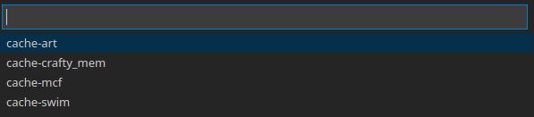

# Cache-Template

This repo contains a template for your Cache project. This includes a `cache.c` file which has boilerplate and a place for you to write your solution, as well as a makefile with `build`, `debug`, `run`, and `clean` targets. The README also contains setup and usage instructions to ease using this template for developing your Cache simulation.

## Requirements

Before running attempting to start work on your cache model, please make sure you have the following software requirements fulfilled:

- [gcc](https://gcc.gnu.org/)
- [gdb](https://www.gnu.org/software/gdb/)
- [make](https://www.gnu.org/software/make/)
- Some kind of text editor (we recommend [Visual Studio Code](https://code.visualstudio.com/))

The next few section go over how to fulfill theses requirements on Windows and MacOS (Linux users, you got this), and how to setup Visual Studio Code to use these tools properly.

## Setup for Windows

To install the requirements on Windows systems, you'll need to first have either MSYS2 (recommended) or Windows Subsystem for Linux (WSL) installed. For instructions on installing and using MSYS2/WSL, please see the instructions included with the Lab 4 files in the [Labs repository](https://github.com/Herring-UGACSEE-4290/Labs)

Once you have MSYS2/WSL setup properly by following the instructions in Lab 4, we can begin to install our requirements.

### MSYS2 Instructions

Open up an MSYS2 terminal and enter the following command to install `gcc`, `gdb`, and `make`:

```
pacman -S gcc gdb make
```

Test this installation by running the following commands in a normal command prompt or PowerShell:

```
gcc --version
gdb --version
make --version
```

If you get some boilerplate text and a version number for all three, you're all set!

### WSL Instructions

Open up a WSL terminal and enter the following command to make sure `gcc`, `gdb`, and `make` are installed:

```
sudo apt install gcc gdb make
```

After entering your WSL password and following the prompts, ensure everything installed correctly by executing these commands:

```
gcc --version
gdb --version
make --version
```

## Setup for MacOS

To make sure we have the right packages installed on MacOS, we'll need to use the `homebrew` package manager. If you don't already have `homebrew` installed on your MacOS machine, install it using this command:

```
/bin/bash -c "$(curl -fsSL https://raw.githubusercontent.com/Homebrew/install/HEAD/install.sh)"
```

Then, make sure you're package list is updated:

```
brew update
brew upgrade
```

Now, install `gcc`, `gdb`, and `make`:

```
brew install gcc gdb make
```

and make sure everything worked:

```
gcc --version
gdb --version
make --version
```

## Additional Setup for Visual Studio Code

To use VS Code to devlop your Cache Simulator, [first install it from here](https://code.visualstudio.com/).

Then, go to the Extensions section and install the C/C++ extension by searching with the tag `ms-vscode.cpptools`.

You can then configure VS Code to use the compiler (gcc) and debugger (gdb) we just installed using the instructions below:
- Windows
    - [Windows with MSYS2](https://code.visualstudio.com/docs/cpp/config-mingw)
    - [Windows with WSL](https://code.visualstudio.com/docs/cpp/config-wsl)
    - [Using GDB with Windows](https://code.visualstudio.com/docs/cpp/cpp-debug#_windows-debugging-with-gdb)
- [Linux/MacOS](https://code.visualstudio.com/docs/cpp/config-linux)

Generally, the VS Code website has all of the information you'll need to setup and customize your C environment for this project.

## Using This Repository with the Terminal

When you're ready to build and run your project for testing simply execute the following commands in your terminal:

```
make build
make run
```

The `run` target will run your code with these parameters:

- associativity = 2
- blocksize_bytes = 32
- cachesize_kb = 64
- miss_penalty = 30

with a default target trace of `art.trace.gz`.

If you would like to run your program with different traces and arguments, append them to the run command like this:

```
make -- run swim -s 32 -a 4 -l 32 -mp 30
```

The above command will compile and run the `cache.c` file with the `swim` trace, and would tell your program to simulate a 32 KB, 4-way set-associative cache with 32-byte blocks, and a 30-cycle miss penalty.

The `--` between `make` and `run` is VERY important, as it prevents the arguments for the cache simulator from being passed to `make`.

## Using This Repository with Visual Studio Code

While the command-line does simplify setup, if you are not comfortable/familiar with it, working with it can be a chore initally. To remedy this, you can setup VS Code to work with the Makefile.

First, make sure you have VS Code otherwise setup for C/C++ development, as detailed in the `Additional Setup for Visual Studio Code` section above. 

Next, install the Makefile Tools extension from the extension settings, the search tag for it is `ms-vscode.makefile-tools`.

Then, go through the initial setup detailed in [these instructions on the Microsoft website.](https://devblogs.microsoft.com/cppblog/now-announcing-makefile-support-in-visual-studio-code/)

In those instructions, it mentions setting up a `makefile.configurations` section in your `settings.json`, which you can do by going to **File -> Preferences -> Settings -> Extensions -> Makefile** and clicking on the `edit settings.json` dialog in the `Makefile: Configurations` section.

When you've got the `settings.json` file open, paste this into it:

```json
,"makefile.configurations": [
        {
            "name": "build",
            "makeArgs": ["build"]
        }
        {
            "name": "clean",
            "makeArgs": ["clean"]
        }
        {
            "name": "cache-art",
            "makeArgs": ["-- run art"]
        }
        ,{
            "name": "cache-crafty_mem",
            "makeArgs": ["-- run crafty_mem"]
        }
        ,{
            "name": "cache-mcf",
            "makeArgs": ["-- run mcf"]
        }
        ,{
            "name": "cache-swim",
            "makeArgs": ["-- run swim"]
        }
    ]
```

Where `name` is the name of the configuration, and `makeArgs` is a string containing the arguments you want to pass to `make`. 

It is possible to specify particular targets to build from the makefile menu, but we want to avoid doing this, and use configurations instead. We need to use configurations exclusively because we cannot specify "no target" (to facilitate some of the argument passing functionality) in the makefile menu, so we'll use configurations to specify both the target and any options to go with it.

In our case, we have configurations for the `build`, `clean`, and several versions of the `run` targets. If you would like to add some options for the cache simulator (as specified in the project document), you can simply edit the corresponding configuration you would like to test, like so:

```json
,{
    "name": "cache-swim",
    "makeArgs": ["-- run swim -s 32 -a 4 -l 32 -mp 30"]
}
```

Which would tell your program to simulate a 32 KB, 4-way set-associative cache with 32-byte blocks, and a 30-cycle miss penalty.

Finally, to build using a configuration, go to the `Makefile` menu on the left side-bar:


and click on the 'pencil' icon to select a configuration (the ones we setup in the `settings.json` file)



When it's selected, click on the 'Build' icon to run the makefile with that command, making sure the Build Target is set to 'unset'.

If you've accidentally set the Build Target, just run the `Makefile: reset the Makefile Tools Extension workspace state (For troubleshooting)` command in the command palette (cntrl-shift-p).

# Conclusions

So, that was a quick overview of how to install/use the toolchain for this project. If you have any questions or need help otherwise, please open an issue on this repository!
